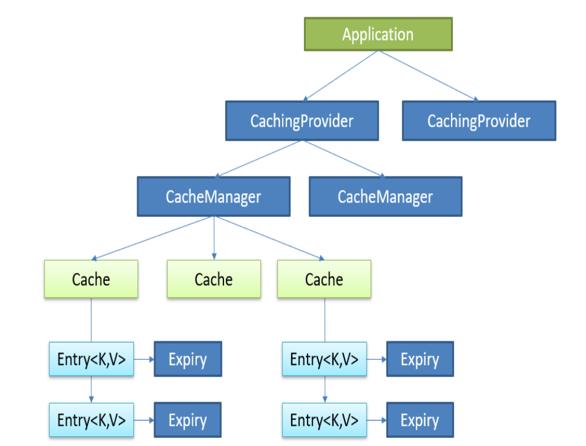
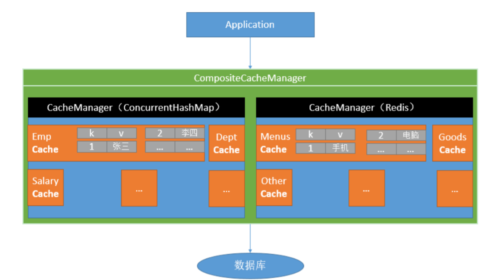

#### 1、JSR107规范

> Java Caching定义了5个核心接口，分别是CachingProvider, CacheManager, Cache, Entry 和 Expiry

+ CachingProvider定义了创建、配置、获取、管理和控制多个CacheManager。一个应用可以在运行期访问多个CachingProvider

+ CacheManager定义了创建、配置、获取、管理和控制多个唯一命名的Cache，这些Cache存在于CacheManager的上下文中。一个CacheManager仅被一个CachingProvider所拥有。

+ Cache是一个类似Map的数据结构并临时存储以Key为索引的值。一个Cache仅被一个CacheManager所拥有。

+ Entry是一个存储在Cache中的key-value对。

+ Expiry 每一个存储在Cache中的条目有一个定义的有效期。一旦超过这个时间，条目为过期的状态。一旦过期，条目将不可访问、更新和删除。缓存有效期可以通过ExpiryPolicy设置。




#### 2、Spring的缓存抽象

Spring从3.1开始定义了org.springframework.cache.Cache和org.springframework.cache.CacheManager接口来统一不同的缓存技术，并支持使用JCache（JSR-107）注解简化我们开发。

+ Cache接口为缓存的组件规范定义，包含缓存的各种操作集合
+ Cache接口下Spring提供了各种xxxCache的实现；如RedisCache，EhCacheCache ,ConcurrentMapCache等

每次调用需要缓存功能的方法时，Spring会检查检查指定参数的指定的目标方法是否已经被调用过；如果有就直接从缓存中获取方法调用后的结果，如果没有就调用方法并缓存结果后返回给用户。下次调用直接从缓存中获取。

+ 使用Spring缓存抽象时我们需要关注以下两点：
  + 确定方法需要被缓存以及缓存策略
  + 从缓存中读取之前缓存存储的数据



#### 3、缓存注解

| 概念/注解      | 描述                               |
| -------------- | :--------------------------------- |
| Cache          | 缓存接口，定义缓存操作             |
| CacheManager   | 缓存管理器，管理各种缓存组件       |
| @Cacheable     | 针对方法进行缓存                   |
| @CacheEvict    | 清空缓存                           |
| @CachePut      | 同步缓存，保证方法调用，结果被缓存 |
| @EnableCaching | 开启基于注解的缓存                 |
| keyGenerator   | 缓存数据时key的生成策略            |
| serialize      | 缓存数据时value的序列化机制        |

缓存操作注解的具体参数说明

| 参数                          | 说明                                                         |
| ----------------------------- | ------------------------------------------------------------ |
| value                         | 定义缓存的名称，至少有一个                                   |
| key                           | 定义缓存的key，可以为空，支持spEL表达式                      |
| condition                     | 缓存的条件，可以为空，使用 SpEL 编写，返回 true或者 false，只有为 true 才进行缓存/清除缓存，在调用方法之前之后都能判断 |
| unless(@Cacheable、@CachePut) | 缓存的条件，在方法执行之后判断，可以拿到方法的返回值进行判断，条件不成立才会缓存 |
| allEntries(@CacheEvict)       | 是否清空所有缓存内容，默认为 false，如果指定为true，则方法调用后将立即清空所有缓存 |
| beforeInvocation(@CacheEvict) | 是否在方法执行前就清空缓存，默认为 false，如果指定为 true，则在方法还没有执行的时候就清空缓存，缺省情况下，如果方法执行抛出异常，则不会清空缓存 |

SpEL表达式

```properties
root:
	methodName:#root.methodName
	method:#root.method
	target:#root.target
	targetClass:#root.targetClass
	args:#root.args
	caches:#root.caches
evaluation context:
	argument name:#param_name/#a0/#a1/#p0/#p1
	result:#result
```

#### 4、Springboot中使用缓存

1）、引入spring-boot-starter-cache模块

2）、@EnableCaching开启缓存

3）、使用缓存注解

4）、切换为其他缓存

+ 将方法运行的结果进行缓存，之后查询相同的数据时，直接从缓存中获取，不在调用方法。
+ CacheManager需要管理多个Cache组件，对数据的增删改操作在Cache组件中，每一个Cache组件有唯一的名称标识

原理：

（1）自动配置类：CacheAutoConfiguration

（2）提供的缓存配置类

```properties
org.springframework.boot.autoconfigure.cache.GenericCacheConfiguration
org.springframework.boot.autoconfigure.cache.JCacheCacheConfiguration
org.springframework.boot.autoconfigure.cache.EhCacheCacheConfiguration
org.springframework.boot.autoconfigure.cache.HazelcastCacheConfiguration
org.springframework.boot.autoconfigure.cache.InfinispanCacheConfiguration
org.springframework.boot.autoconfigure.cache.CouchbaseCacheConfiguration
org.springframework.boot.autoconfigure.cache.RedisCacheConfiguration
org.springframework.boot.autoconfigure.cache.CaffeineCacheConfiguration
org.springframework.boot.autoconfigure.cache.GuavaCacheConfiguration
org.springframework.boot.autoconfigure.cache.SimpleCacheConfiguration【默认】
org.springframework.boot.autoconfigure.cache.NoOpCacheConfiguration
```

（3）默认的配置类：SimpleCacheConfiguration

（4）给容器注入了ConcurrentMapCacheManager，作为CacheManager，使用ConcurrentMap<String, Cache>保存cache组件

（5）ConcurrentMapCacheManager获取和创建cache组件(ConcurrentMapCache)

（6）ConcurrentMapCache内部使用ConcurrentMap<Object, Object>存储/获取数据

##### @Cacheable运行流程

（1）方法运行之前，先去查询Cache（缓存组件），按照cacheNames指定的名字获取，（CacheManager先获取相应的缓存），第一次获取缓存如果没有Cache组件会自动创建。

（2）去Cache中查找缓存的内容，使用一个key，默认就是方法的参数

key是按照某种策略生成的，默认使用SimpleKeyGenerator生成key

```java
public static Object generateKey(Object... params) {
    if (params.length == 0) {
        return SimpleKey.EMPTY;// 没有参数
    }
    if (params.length == 1) {// 一个参数
        Object param = params[0];
        if (param != null && !param.getClass().isArray()) {
            return param;
        }
    }// 大于1个参数
    return new SimpleKey(params);
}
public SimpleKey(Object... elements) {
    this.params = new Object[elements.length];
    System.arraycopy(elements, 0, this.params, 0, elements.length);
    this.hashCode = Arrays.deepHashCode(this.params);
}
```

（3）在缓存中没有查询到数据就调用方法

（4）将目标方法返回的结果，放进缓存中

+ @Cacheable标注的方法执行之前先来检查缓存中有没有这个数据，默认按照参数的值作为key去查询缓存，如果没有就运行方法并将结果放入缓存。以后再来调用就可以直接使用缓存中的数据

注解的属性：

| 属性             | 作用                                                         |
| ---------------- | ------------------------------------------------------------ |
| cacheNames/value | 指定缓存组件的名字;将方法的返回结果放在哪个缓存中，是数组的方式，可以指定多个缓存 |
| key              | 缓存数据使用的key                                            |
| keyGenerator     | key的生成器，可以自己指定key的生成器。key和keyGenerator二选一 |
| cacheManager     | 指定缓存管理器或者cacheResolver指定获取解析器                |
| condition        | 指定符合条件的情况下才缓存                                   |
| unless           | unless的条件为true，方法的返回值就不会被缓存,可以对结果进行判断 |
| sync             | 是否使用异步模式                                             |

##### @CachePut

> 既调用方法，又更新缓存数据  --->  同步更新缓存

运行时机：先调用目标方法，然后将目标方法的结果缓存起来

##### @CacheEvict

> 缓存清除

key：指定要清除的数据

allEntries = true：指定清除这个缓存中所有的数据

beforeInvocation = false：缓存的清除是否在方法之前执行，默认代表缓存清除操作是在方法执行之后执行，如果出现异常缓存就不会清除

beforeInvocation = true：代表清除缓存操作是在方法运行之前执行，无论方法是否出现异常，缓存都清除


#### 5、Springboot中使用redis作为缓存

1）、引入spring-boot-starter-data-redis模块

2）、配置文件配置redis地址

3）、使用redisTemplate操作缓存

4）、配置缓存管理器、自定义缓存模板


