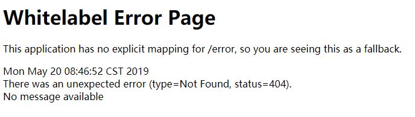
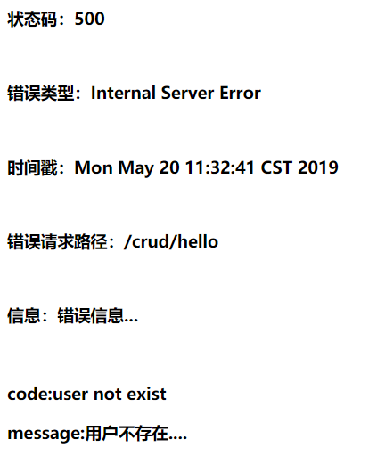

1、配置Thymeleaf

静态资源路径配置

```html
<script type="text/javascript" src="/js/bootstrap.min.js"></script><!-- static不用写-->
<link th:href="@{/webjars/bootstrap/4.0.0/css/bootstrap.css}" rel="stylesheet">
<link th:href="@{/css/dashboard.css}" rel="stylesheet">

```

默认访问首页，直接实现**WebMvcConfigurer**接口，进行视图配置

```java
@Configuration
public class MyMvcConfig implements WebMvcConfigurer {
    @Override
    public void addViewControllers(ViewControllerRegistry registry) {
        registry.addViewController("/").setViewName("index");
        registry.addViewController("/index.html").setViewName("index");
    }
}
```

## 2、国际化配置

1）、编写国际化配置文件

2）、使用ResourceBundleMessageSource管理国际化资源文件

3）、在页面使用fmt:message取出国际化内容

```properties
login.btn=login
login.password=password
login.remember=remember me
login.tip=please sign in
login.username=username
```

```properties
login.btn=登录
login.password=密码
login.remember=记住我
login.tip=请登录
login.username=用户名
```

配置springboot配置文件

```properties
# 清除缓存
spring.thymeleaf.cache=false 
# i18n的配置文件路径
spring.messages.basename=i18n/login
```

使用#{}获取国际化的值

```html
<h1 class="h3 mb-3 font-weight-normal" th:text="#{login.tip}"></h1>
<label class="sr-only" th:text="#{login.username}">Username</label>
<input type="text" class="form-control" th:placeholder="#{login.username}" placeholder="Username" required="" autofocus="">
<label class="sr-only" th:text="#{login.password}">Password</label>
<input type="password" class="form-control" th:placeholder="#{login.password}" placeholder="Password" required="">
<div class="checkbox mb-3">
    <label>
          <input type="checkbox"  value="remember-me" /> [[#{login.remember}]]
```

根据浏览器语言设置切换显示的语言。

原理：

```java
@Configuration
@ConditionalOnMissingBean(value = MessageSource.class, search = SearchStrategy.CURRENT)
@AutoConfigureOrder(Ordered.HIGHEST_PRECEDENCE)
@Conditional(ResourceBundleCondition.class)
@EnableConfigurationProperties
public class MessageSourceAutoConfiguration {
```

```java
@Bean
public MessageSource messageSource() {
    MessageSourceProperties properties = messageSourceProperties(); // 构建messageSourceProperties对象
    // 国际化支持主要是通过ResourceBundleMessageSource实现
    ResourceBundleMessageSource messageSource = new ResourceBundleMessageSource();
    if (StringUtils.hasText(properties.getBasename())) {// 设置基本名称
        messageSource.setBasenames(StringUtils.commaDelimitedListToStringArray(
            StringUtils.trimAllWhitespace(properties.getBasename())));
    }
    if (properties.getEncoding() != null) {// 设置编码
        messageSource.setDefaultEncoding(properties.getEncoding().name());
    }
    messageSource.setFallbackToSystemLocale(properties.isFallbackToSystemLocale());
    Duration cacheDuration = properties.getCacheDuration();
    if (cacheDuration != null) {
        messageSource.setCacheMillis(cacheDuration.toMillis());
    }
    messageSource.setAlwaysUseMessageFormat(properties.isAlwaysUseMessageFormat());
    messageSource.setUseCodeAsDefaultMessage(properties.isUseCodeAsDefaultMessage());
    return messageSource;
}
```

```java
@Bean
@ConfigurationProperties(prefix = "spring.messages")
public MessageSourceProperties messageSourceProperties() {
    return new MessageSourceProperties();
}
```

配置i18n的配置文件路径：

```proper
spring.messages.basename=i18n/login
```

4）、点击链接切换国际化

```java
/**
 * 可以在连接上携带区域信息
 */
public class MyLocaleResolver implements LocaleResolver {  
    @Override
    public Locale resolveLocale(HttpServletRequest request) {
        String l = request.getParameter("l");
        Locale locale = Locale.getDefault();
        if(!StringUtils.isEmpty(l)){
            String[] split = l.split("_");
            locale = new Locale(split[0],split[1]);
        }
        return locale;
    }

    @Override
    public void setLocale(HttpServletRequest request, HttpServletResponse response, Locale locale) {
    }
}

 @Bean
    public LocaleResolver localeResolver(){
        return new MyLocaleResolver();
    }
}
```

原理：**WebMvcAutoConfiguration**中的localeResolver()方法

```java
@Bean
@ConditionalOnMissingBean
@ConditionalOnProperty(prefix = "spring.mvc", name = "locale")
public LocaleResolver localeResolver() {
    if (this.mvcProperties
        .getLocaleResolver() == WebMvcProperties.LocaleResolver.FIXED) {
        return new FixedLocaleResolver(this.mvcProperties.getLocale());
    }
    AcceptHeaderLocaleResolver localeResolver = new AcceptHeaderLocaleResolver();
    localeResolver.setDefaultLocale(this.mvcProperties.getLocale());
    return localeResolver;
}
```

**AcceptHeaderLocaleResolver**

```java
@Override
public Locale resolveLocale(HttpServletRequest request) {
    Locale defaultLocale = getDefaultLocale();
    if (defaultLocale != null && request.getHeader("Accept-Language") == null) {
        return defaultLocale;
    }
    Locale requestLocale = request.getLocale();// 获取request的locale属性
    List<Locale> supportedLocales = getSupportedLocales();
    if (supportedLocales.isEmpty() || supportedLocales.contains(requestLocale)) {
        return requestLocale;
    }
    Locale supportedLocale = findSupportedLocale(request, supportedLocales);
    if (supportedLocale != null) {
        return supportedLocale;
    }
    return (defaultLocale != null ? defaultLocale : requestLocale);
}
```

## 3、登录

1）登录的表单提交

```html
<form class="form-signin" th:action="@{/user/login}" method="post">
```

2）登录的Controller

```java
@PostMapping("/user/login")
public String login(@RequestParam String username, @RequestParam String password,
                    Map<String,Object> map, HttpSession session){
    if(!StringUtils.isEmpty(username) && password.equals("123456")){ // 调用服务判断
        session.setAttribute("loginuser",username);// 放入session拦截器使用
        return "redirect:/main.html";	// 重定向，防止重复提交
    }else{
        map.put("msg","用户名或密码错误");// 密码或者账号错误处理
        return "/index";
    }
}
```

3）重定向配置

```java
registry.addViewController("/main.html").setViewName("emp/dashboard");
```

4）拦截器配置

```java
@Override
public boolean preHandle(HttpServletRequest request, HttpServletResponse response, Object handler) throws Exception {
    // 获取session的中用户名
    Object loginuser = request.getSession().getAttribute("loginuser");
    if(loginuser == null){
        // 转发到登陆页面，设置错误信息
        request.setAttribute("msg","没有权限请先登陆");
        request.getRequestDispatcher("/index.html").forward(request,response);
        return false;
    }
    return true;
}
@Override
public void addInterceptors(InterceptorRegistry registry) {
    registry.addInterceptor(new LoginHandlerInterceptor())
        .addPathPatterns("/**")
        .excludePathPatterns("/index.html","/","/user/login");
}
```

5）页面信息获取

```html
<p style="color: red" th:text="${msg}" th:if="${not #strings.isEmpty(msg)}"></p>
```

## 4、页面配置

1）使用Thymeleaf抽取页面

三种引入公共片段的th属性：

**th:insert**：将公共片段整个插入到声明引入的元素中

**th:replace**：将声明引入的元素替换为公共片段

**th:include**：将被引入的片段的内容包含进这个标签中

写法：

~{templatename::selector}：模板名::选择器

~{templatename::fragmentname}：模板名::片段名

行内写法可以加上：[[~{}]]	[(~{})]

```html
<footer th:fragment="copy">
&copy; 2011 The Good Thymes Virtual Grocery
</footer>
引入方式：可以不使用	~{}
<div th:insert="footer :: copy"></div>
<div th:replace="footer :: copy"></div>
<div th:include="footer :: copy"></div>

效果：
----------------
<div>
    <footer>
    &copy; 2011 The Good Thymes Virtual Grocery
    </footer>
</div>
----------------
<footer>
&copy; 2011 The Good Thymes Virtual Grocery
</footer>
----------------
<div>
&copy; 2011 The Good Thymes Virtual Grocery
</div>
```

构建模版片段

```html
<!-- bar top template -->
<nav th:fragment="topbar" class="...">
	...
</nav>
<!-- side bar template -->
<nav class="col-md-2 d-none d-md-block bg-light sidebar" id="sidebar">
    <a th:class="${activeUrl=='main.html'?'nav-link active':'nav-link'}"
         th:href="@{/main.html}">
     <a th:href="@{/emps}" th:class="${activeUrl=='emps'?'nav-link active':'nav-link'}">   ...
```

引用模版

```html
<div th:replace="commons/bar::topbar"></div>
<!-- 引用模版传参 #表示根据id找片段 不用#会找th:fragment  -->
<div th:replace="commons/bar::#sidebar(activeUri='main.html')"></div>
<div th:replace="commons/bar::#sidebar(activeUri='emps')"></div>
```

## 5、Restful规定

| 功能                                 | 请求URI | 请求方式 |
| ------------------------------------ | ------- | -------- |
| 查询所有员工                         | emps    | GET      |
| 查询某个员工(来到修改页面)           | emp/1   | GET      |
| 来到添加页面                         | emp     | GET      |
| 添加员工                             | emp     | POST     |
| 来到修改页面（查出员工进行信息回显） | emp/1   | GET      |
| 修改员工                             | emp     | PUT      |
| 删除员工                             | emp/1   | DELETE   |

添加页面引入

```html
<div class="container-fluid">
    <div class="row">
        <!--引入侧边栏-->
        <div th:replace="commons/bar::#sidebar(activeUri='emps')"></div>

        <main role="main" class="col-md-9 ml-sm-auto col-lg-10 pt-3 px-4">
            <!--需要区分是员工修改还是添加；-->
            <form th:action="@{/emp}" method="post">
                <!--发送put请求修改员工数据-->
<!--
    1、SpringMVC中配置HiddenHttpMethodFilter;（SpringBoot自动配置好的）
    2、页面创建一个post表单
    3、修改对象时，创建一个input，name="_method";值就是我们指定的请求方式put
-->
<input type="hidden" name="_method" value="put" th:if="${emp!=null}"/>
<input type="hidden" name="id" th:if="${emp!=null}" th:value="${emp.id}">
	<div class="form-group">
        <label>LastName</label>
        <input name="lastName" type="text" class="form-control" placeholder="zhangsan" th:value="${emp!=null}?${emp.lastName}">
    </div>
    <div class="form-group">
    	<label>Email</label>
        <input name="email" type="email" class="form-control" placeholder="zhangsan@atguigu.com" th:value="${emp!=null}?${emp.email}">
    </div>
    <div class="form-group">
    	<label>Gender</label><br/>
        <div class="form-check form-check-inline">
        <input class="form-check-input" type="radio" name="gender" value="1" th:checked="${emp!=null}?${emp.gender==1}">
        <label class="form-check-label">男</label>
    </div>
    <div class="form-check form-check-inline">
    	<input class="form-check-input" type="radio" name="gender" value="0" th:checked="${emp!=null}?${emp.gender==0}">
        <label class="form-check-label">女</label>
	</div>
    </div>
    <div class="form-group">
    	<label>department</label>
        <!--提交的是部门的id-->
        <select class="form-control" name="department.id">
        	<option th:selected="${emp!=null}?${dept.id == emp.department.id}" th:value="${dept.id}" th:each="dept:${departments}" th:text="${dept.departmentName}">1</option>
		</select>
    </div>
	<div class="form-group">
    	<label>Birth</label>
        <input name="birth" type="text" class="form-control" placeholder="zhangsan" th:value="${emp!=null}?${#dates.format(emp.birth, 'yyyy-MM-dd')}">
	</div>
    <button type="submit" class="btn btn-primary" th:text="${emp!=null}?'修改':'添加'">添加</button>
    </form>
    </main>
    </div>
</div>
```

列表页面

```html
<tr th:each="emp : ${data}">
    <td th:text="${emp.id}">1,015</td>
    <td>[[${emp.lastName}]]</td>
    <td th:text="${emp.email}">ligula</td>
    <td th:text="${emp.gender}==0?'女':'男'">in</td>
    <td th:text="${emp.department.departmentName}">libero</td>
    <td th:text="${#dates.format(emp.birth,'yyyy-MM-dd')}">libero</td>
    <td>
        <a class="btn btn-sm btn-primary" th:href="@{/emp/}+${emp.id}">编辑</a>
        <button th:attr="del_uri=@{/emp/}+${emp.id}" class="btn btn-sm btn-danger deleteBtn">删除</button>
    </td>
</tr>
<form id="deleteEmpForm" method="post">
    <input type="hidden" name="_method" value="delete" />
</form>
```

```js
$(".deleteBtn").click(function () {
    $("#deleteEmpForm").attr("action",$(this).attr("del_uri")).submit();
});
```

## 6、错误处理

SpringBoot在服务器或者客户端出错时，会默认返回一个错误页面。

概述：当系统出现4xx或者5xx的错误时，ErrorPageCustomizer就会构建errorPage对象，将请求映射到配置的错误请求路径(默认是/error)。请求(浏览器或者客户端)就会被BasicErrorController处理，内部包括获取错误信息，得到错误页面等。最终返回modelAndView或者ResponseEntity。

原理：**ErrorMvcAutoConfiguration**，SpringBoot对错误处理的自动配置

```java
@Configuration
@ConditionalOnWebApplication(type = Type.SERVLET)
@ConditionalOnClass({ Servlet.class, DispatcherServlet.class })
// Load before the main WebMvcAutoConfiguration so that the error View is available
@AutoConfigureBefore(WebMvcAutoConfiguration.class)
@EnableConfigurationProperties({ ServerProperties.class, ResourceProperties.class })
public class ErrorMvcAutoConfiguration {
```

给容器中添加了**DefaultErrorAttributes**，**BasicErrorController**，**ErrorMvcAutoConfiguration**，**ErrorPageCustomizer**，**PreserveErrorControllerTargetClassPostProcessor**，**BeanNameViewResolver**，**DefaultErrorViewResolver**

step1：一旦系统出现4xx或者5xx之类的错误**ErrorPageCustomizer**就会生效（定制错误的响应规则）

+ 注册一个错误页面的对象：内置错误的请求路径、错误的状态码、错误的异常信息
+ 错误处理的配置在ErrorProperties类中

```java
@Override
public void registerErrorPages(ErrorPageRegistry errorPageRegistry) {
    ErrorPage errorPage = new ErrorPage(this.dispatcherServletPath                                 .getRelativePath(this.properties.getError().getPath()));
    errorPageRegistry.addErrorPages(errorPage);
}
public class ErrorProperties {
	/**
	 * Path of the error controller.
	 */
	@Value("${error.path:/error}")
	private String path = "/error";
    
@ConfigurationProperties(prefix = "server", ignoreUnknownFields = true)
public class ServerProperties {
@NestedConfigurationProperty	// 嵌套配置
private final ErrorProperties error = new ErrorProperties();
```

step2：处理错误请求(/error)  BasicErrorController

```java
@RequestMapping(produces = "text/html")// 处理浏览器请求
public ModelAndView errorHtml(HttpServletRequest request,
                              HttpServletResponse response) {
    HttpStatus status = getStatus(request);
    Map<String, Object> model = Collections.unmodifiableMap(getErrorAttributes(
        request, isIncludeStackTrace(request, MediaType.TEXT_HTML)));
    response.setStatus(status.value());
    ModelAndView modelAndView = resolveErrorView(request, response, status, model);// 构建modelAndView
    return (modelAndView != null) ? modelAndView : new ModelAndView("error", model);// 构建失败则返回由springboot书写的error视图带上model数据
}
@RequestMapping//处理客户端请求，根据请求头区分是什么类型的请求
@ResponseBody
public ResponseEntity<Map<String, Object>> error(HttpServletRequest request) {
    Map<String, Object> body = getErrorAttributes(request,
                         isIncludeStackTrace(request, MediaType.ALL));
    HttpStatus status = getStatus(request);
    return new ResponseEntity<>(body, status);// 直接返回数据
}
```

（1）浏览器响应页面

step2.1.1：获取数据DefaultErrorAttributes

```java
protected Map<String, Object> getErrorAttributes(HttpServletRequest request,
			boolean includeStackTrace) {
    WebRequest webRequest = new ServletWebRequest(request);
    return this.errorAttributes.getErrorAttributes(webRequest, includeStackTrace);
}
public Map<String, Object> getErrorAttributes(WebRequest webRequest, boolean includeStackTrace) {
    Map<String, Object> errorAttributes = new LinkedHashMap();
    errorAttributes.put("timestamp", new Date());// 添加时间戳
    this.addStatus(errorAttributes, webRequest);// 状态码
    this.addErrorDetails(errorAttributes, webRequest, includeStackTrace);
    this.addPath(errorAttributes, webRequest);// 错误路径
    return errorAttributes;
}
```

step2.1.2：构建响应页面由DefaultErrorViewResolver解析得到

```java
protected ModelAndView resolveErrorView(HttpServletRequest request,
 HttpServletResponse response, HttpStatus status, Map<String, Object> model) {
    for (ErrorViewResolver resolver : this.errorViewResolvers) {// 所有的resolver
        ModelAndView modelAndView = resolver.resolveErrorView(request, status, model);
        if (modelAndView != null) {
            return modelAndView;
        }
    }
    return null;
}
```

404错误时，错误页面的寻找顺序：

**templates/error/404.**

**static/error/404.html**

**templates/error/4xx.**

**static/error/4xx.html**

```java
static {
    Map<Series, String> views = new EnumMap<>(Series.class);
    views.put(Series.CLIENT_ERROR, "4xx");
    views.put(Series.SERVER_ERROR, "5xx");
    SERIES_VIEWS = Collections.unmodifiableMap(views);
}
@Override
public ModelAndView resolveErrorView(HttpServletRequest request, HttpStatus status, Map<String, Object> model) {
    ModelAndView modelAndView = resolve(String.valueOf(status), model);
    if (modelAndView == null && SERIES_VIEWS.containsKey(status.series())) {
        modelAndView = resolve(SERIES_VIEWS.get(status.series()), model);
    }
    return modelAndView;
}
private ModelAndView resolve(String viewName, Map<String, Object> model) {
     // SpringBoot寻找错误页面 error/404 500 400...
    String errorViewName = "error/" + viewName;
    // 使用模版引擎渲染上面的errorViewName
    TemplateAvailabilityProvider provider = this.templateAvailabilityProviders
        .getProvider(errorViewName, this.applicationContext);
    if (provider != null) {
        return new ModelAndView(errorViewName, model);// 返回模板引擎渲染的视图对象
    }
    return resolveResource(errorViewName, model);// 模板不可用，找静态资源
}
private ModelAndView resolveResource(String viewName, Map<String, Object> model) {
    for (String location : this.resourceProperties.getStaticLocations()) {
        try {
            Resource resource = this.applicationContext.getResource(location);
            resource = resource.createRelative(viewName + ".html");// 404.html..
            if (resource.exists()) {// 使用html的解析器解析视图
                return new ModelAndView(new HtmlResourceView(resource), model);
            }
        }catch (Exception ex) {
        }}
    return null;
}
```

error视图对象

```java
@Configuration
@ConditionalOnProperty(prefix = "server.error.whitelabel", name = "enabled", matchIfMissing = true)
@Conditional(ErrorTemplateMissingCondition.class)
protected static class WhitelabelErrorViewConfiguration {

    private final SpelView defaultErrorView = new SpelView(
        "<html><body><h1>Whitelabel Error Page</h1>"
        + "<p>This application has no explicit mapping for /error, so you are seeing this as a fallback.</p>"
        + "<div id='created'>${timestamp}</div>"
        + "<div>There was an unexpected error (type=${error}, status=${status}).</div>"
        + "<div>${message}</div></body></html>");
    @Bean(name = "error")// erro视图对象
    @ConditionalOnMissingBean(name = "error")
    public View defaultErrorView() {
        return this.defaultErrorView;
    }
}
```

（2）处理客户端请求

step2.2.1获取数据

```java
protected Map<String, Object> getErrorAttributes(HttpServletRequest request,
			boolean includeStackTrace) {
    WebRequest webRequest = new ServletWebRequest(request);
return this.errorAttributes.getErrorAttributes(webRequest, includeStackTrace);
}
```

step2.2.2构建响应数据，返回到客户端

```java
public HttpEntity(@Nullable T body, @Nullable MultiValueMap<String, String> headers) {
    this.body = body;
    HttpHeaders tempHeaders = new HttpHeaders();
    if (headers != null) {
        tempHeaders.putAll(headers);
    }
    this.headers = HttpHeaders.readOnlyHttpHeaders(tempHeaders);
}
```

## 7、定制错误页面

### 7.1 定制响应页面

（1）当存在模板引擎时，根据上述原理，模板引擎会解析**error/状态码**

+ 将错误页面命名为：错误状态码.html 放在模板引擎文件夹里面的 error文件夹下	templates/error/400.html
+ 也可命名为4xx.html    5xx.html

（2）没有模板引擎时或者模版引擎文件夹的 error文件夹下没有对应的文件，就会在静态资源文件夹下寻找

+ static/400.html
+ static/4xx.html

（3）以上文件都不存在就默认来到SpringBoot默认的错误提示页面



### 7.2 定制响应数据

step1：自定义异常

```java
@Component
public class UserNotExistException extends RuntimeException{
    public UserNotExistException() {
        super("用户不存在....");
    }
}
```

step2：测试请求

```java
@RequestMapping("/hello")
@ResponseBody
public String hello(@RequestParam(name="test") String param){
    if(param.equals("abc")){
        throw new UserNotExistException();
    }
    return "hello";
}
```

step3：捕获请求异常

```java
@ControllerAdvice
public class MyExceptionHandler {
    @ExceptionHandler(UserNotExistException.class)
    public String handlerException(HttpServletRequest request,Exception e){
        Map<String,Object> map = new HashMap<>();
        // 设置转发到错误请求的状态码
        request.setAttribute("javax.servlet.error.status_code",500);
        map.put("code","user not exist");
        map.put("message",e.getMessage());
        // 在将map数据放入到request中
        request.setAttribute("ext",map);
        // 转发到error请求
        return "forward:/error";
    }
}
```

step4：自定义异常数据

```java
@Component
public class MyErrorAttributes extends DefaultErrorAttributes {
    @Override
public Map<String, Object> getErrorAttributes(WebRequest webRequest, boolean 													includeStackTrace) {
Map<String,Object> map = super.getErrorAttributes(webRequest,includeStackTrace);
map.put("info","错误信息...");
// 从request中获取添加的数据 request->0  session->1
Map<String,Object> ext = (Map<String,Object>) webRequest.getAttribute("ext",0);
        // 放入map中返回
        map.put("ext",ext);
        return map;
    }
}
```

step5：测试结果



```json
// 客户端json测试数据
{
    "timestamp": "2019-05-20T03:28:48.515+0000",
    "status": 500,
    "error": "Internal Server Error",
    "message": "用户不存在....",
    "path": "/crud/hello",
    "info": "错误信息...",
    "ext": {
        "code": "user not exist",
        "message": "用户不存在...."
    }
}
```

##8、Spring配置servlet、Filter、Linstener

```java
@Configuration
public class MyMvcConfig implements WebMvcConfigurer {
// 注册Servlet
@Bean
public ServletRegistrationBean myServlet(){
    ServletRegistrationBean registrationBean = new ServletRegistrationBean();
    registrationBean.setServlet(new Myservlet());
    registrationBean.addUrlMappings("/myservlet");
    return registrationBean;
}

// 注册Filter
@Bean
public FilterRegistrationBean myFilter(){
    FilterRegistrationBean filterRegistrationBean = new FilterRegistrationBean();
    filterRegistrationBean.setFilter(new MyFilter());
    filterRegistrationBean.setUrlPatterns(Arrays.asList("/hello","/myservlet"));
    return filterRegistrationBean;
}

// 注册Listener
@Bean
public ServletListenerRegistrationBean myListener(){
    ServletListenerRegistrationBean listenerRegistrationBean = new ServletListenerRegistrationBean();
    listenerRegistrationBean.setListener(new MyListener());
    return listenerRegistrationBean;

}
```

Springboot在自动配置SpringMVC自动配置前端控制器DispatcherServlet

```java
//dispatcherServlet==>拦截所有请求包括静态资源，但是不会拦截jsp
//	The bean name for a DispatcherServlet that will be mapped to the root URL "/"
//dispatcherServletRegistration==>
//	The bean name for a ServletRegistrationBean for the DispatcherServlet "/"
@Bean(name = DEFAULT_DISPATCHER_SERVLET_BEAN_NAME)
public DispatcherServlet dispatcherServlet() {
    DispatcherServlet dispatcherServlet = new DispatcherServlet();
    dispatcherServlet.setDispatchOptionsRequest(
        this.webMvcProperties.isDispatchOptionsRequest());
    dispatcherServlet.setDispatchTraceRequest(
        this.webMvcProperties.isDispatchTraceRequest());
    dispatcherServlet.setThrowExceptionIfNoHandlerFound(
        this.webMvcProperties.isThrowExceptionIfNoHandlerFound());
    return dispatcherServlet;
}
```

**可以通过server.servletPath来修改SpringMVC前端控制器默认拦截的请求路径**

##9、SpringBoot支持的内嵌容器


Springboot中的web容器成为webServer，由xxxWebServerFactory创建，内嵌容器支持jetty、tomcat和Undertow。

以Tomcat为例：SpringBoot中的Tomcat容器是由tomcat在Spring中的代理TomcatReactiveWebServerFactory创建。

spring容器在启动的过程中根据ServletWebServerFactoryAutoConfiguration构建相应的BeanDefinition，其中就有TomcatServletWebServerFactory。

Spring容器ServletWebServerApplicationContext中通过**onRefresh()方法创建了WebServer**，通过**finishRefresh()方法启动WebServer**，开始对外提供服务。

```java
protected void onRefresh() {
    super.onRefresh();
    try {// 创建server
        this.createWebServer();
    } catch (Throwable var2) {
        throw new ApplicationContextException("Unable to start web server", var2);
    }
}

protected void finishRefresh() {
    super.finishRefresh();// 启动server
    WebServer webServer = this.startWebServer();
    if (webServer != null) {
        this.publishEvent(new ServletWebServerInitializedEvent(webServer, this));
    }
}
```

进入**createWebServer**方法：

```java
private void createWebServer() {
    WebServer webServer = this.webServer;
    ServletContext servletContext = this.getServletContext();
    if (webServer == null && servletContext == null) {
        // 拿到一个server工厂
        ServletWebServerFactory factory = this.getWebServerFactory();
        // 创建server
        this.webServer = factory.getWebServer(new ServletContextInitializer[]{this.getSelfInitializer()});
    } else if (servletContext != null) {
        try {
            this.getSelfInitializer().onStartup(servletContext);
        } catch (ServletException var4) {
            throw new ApplicationContextException("Cannot initialize servlet context", var4);
        }
    }
    this.initPropertySources();
}
```


分析**TomcatServletWebServerFactory**中**getWebServer**

```java
public WebServer getWebServer(ServletContextInitializer... initializers) {
    Tomcat tomcat = new Tomcat();// 创建tomcat对象
    File baseDir = this.baseDirectory != null ? this.baseDirectory : this.createTempDir("tomcat");// 设置属性
    tomcat.setBaseDir(baseDir.getAbsolutePath());
    Connector connector = new Connector(this.protocol);
    tomcat.getService().addConnector(connector);
    this.customizeConnector(connector);
    tomcat.setConnector(connector);
    tomcat.getHost().setAutoDeploy(false);
    this.configureEngine(tomcat.getEngine());
    Iterator var5 = this.additionalTomcatConnectors.iterator();
    while(var5.hasNext()) {
        Connector additionalConnector = (Connector)var5.next();
        tomcat.getService().addConnector(additionalConnector);
    }
    this.prepareContext(tomcat.getHost(), initializers);
    return this.getTomcatWebServer(tomcat);// 根据tomcat对象创建TomcatWebServer对象
}
```

分析ServletWebServerApplicationContext中的**startWebServer**方法

```java
private WebServer startWebServer() {
    WebServer webServer = this.webServer;
    if (webServer != null) {
        webServer.start();
    }
    return webServer;
}
```

###替换内嵌容器

web环境下默认使用tomcat

Jetty

```xml
<!-- 引入web模块 -->
<dependency>
   <groupId>org.springframework.boot</groupId>
   <artifactId>spring-boot-starter-web</artifactId>
   <exclusions>
      <exclusion>
         <artifactId>spring-boot-starter-tomcat</artifactId>
         <groupId>org.springframework.boot</groupId>
      </exclusion>
   </exclusions>
</dependency>
<!--引入其他的Servlet容器-->
<dependency>
   <artifactId>spring-boot-starter-jetty</artifactId>
   <groupId>org.springframework.boot</groupId>
</dependency>
```

Undertow

```xml
<!-- 引入web模块 -->
<dependency>
   <groupId>org.springframework.boot</groupId>
   <artifactId>spring-boot-starter-web</artifactId>
   <exclusions>
      <exclusion>
         <artifactId>spring-boot-starter-tomcat</artifactId>
         <groupId>org.springframework.boot</groupId>
      </exclusion>
   </exclusions>
</dependency>
<!--引入其他的Servlet容器-->
<dependency>
   <artifactId>spring-boot-starter-undertow</artifactId>
   <groupId>org.springframework.boot</groupId>
</dependency>
```

### 嵌入式Servlet容器的自动配置

自动配置Servlet容器类：**ServletWebServerFactoryAutoConfiguration**

```java
@EnableConfigurationProperties(ServerProperties.class)// ServerProperties有关server参数配置
// BeanPostProcessorsRegistrar后置处理器：bean初始化前后（创建完对象，还没赋值赋值）执行，初始化工作
@Import({ ServletWebServerFactoryAutoConfiguration.BeanPostProcessorsRegistrar.class,
		ServletWebServerFactoryConfiguration.EmbeddedTomcat.class,// 根据条件配置容器
		ServletWebServerFactoryConfiguration.EmbeddedJetty.class,
		ServletWebServerFactoryConfiguration.EmbeddedUndertow.class })
public class ServletWebServerFactoryAutoConfiguration {
```

根据条件配置容器**ServletWebServerFactoryConfiguration**

```java
@Configuration// ConditionalOnClass
@ConditionalOnClass({ Servlet.class, Tomcat.class, UpgradeProtocol.class })
@ConditionalOnMissingBean(value = ServletWebServerFactory.class, search = SearchStrategy.CURRENT)
public static class EmbeddedTomcat {
    @Bean
    public TomcatServletWebServerFactory tomcatServletWebServerFactory() {
        return new TomcatServletWebServerFactory();
    }
}
@Configuration// Jetty
@ConditionalOnClass({ Servlet.class, Server.class, Loader.class,WebAppContext.class })
@ConditionalOnMissingBean(value = ServletWebServerFactory.class, search = SearchStrategy.CURRENT)
public static class EmbeddedJetty {
    @Bean
    public JettyServletWebServerFactory JettyServletWebServerFactory() {
        return new JettyServletWebServerFactory();
    }
}
@Configuration// Undertow
@ConditionalOnClass({ Servlet.class, Undertow.class, SslClientAuthMode.class })
@ConditionalOnMissingBean(value = ServletWebServerFactory.class, search = SearchStrategy.CURRENT)
public static class EmbeddedUndertow {
    @Bean
    public UndertowServletWebServerFactory undertowServletWebServerFactory() {
        return new UndertowServletWebServerFactory();
    }
}
```

以**TomcatServletWebServerFactory**为例：

```java
public WebServer getWebServer(ServletContextInitializer... initializers) {
    Tomcat tomcat = new Tomcat();//创建一个tomcat
    File baseDir = this.baseDirectory != null ? this.baseDirectory : this.createTempDir("tomcat");
    tomcat.setBaseDir(baseDir.getAbsolutePath());// 配置Tomcat
    Connector connector = new Connector(this.protocol);
    tomcat.getService().addConnector(connector);
    this.customizeConnector(connector);
    tomcat.setConnector(connector);
    tomcat.getHost().setAutoDeploy(false);
    this.configureEngine(tomcat.getEngine());
    Iterator var5 = this.additionalTomcatConnectors.iterator();
    while(var5.hasNext()) {
        Connector additionalConnector = (Connector)var5.next();
        tomcat.getService().addConnector(additionalConnector);
    }
    this.prepareContext(tomcat.getHost(), initializers);
    return this.getTomcatWebServer(tomcat);// 传入tomcat，返回TomcatWebServer
}
```

修改server的配置
+ ServerProperties

Servlet容器配置过程：

1、SpringBoot根据导入的依赖情况，给容器中添加相应的容器工厂

ServletWebServerFactoryConfiguration--->TomcatServletWebServerFactory

2、触发容器的后置处理器

ServletWebServerFactoryAutoConfiguration	.BeanPostProcessorsRegistrar

3、导入ServletWebServerFactoryCustomizer，调用定制方法。

### 使用外部的容器

1、创建一个war项目

2、将嵌入式的Tomcat指定为provided

```xml
<dependency>
   <groupId>org.springframework.boot</groupId>
   <artifactId>spring-boot-starter-tomcat</artifactId>
   <scope>provided</scope>
</dependency>
```

3、编写一个**SpringBootServletInitializer**的子类，并调用configure方法

```java
public class ServletInitializer extends SpringBootServletInitializer {
   @Override
   protected SpringApplicationBuilder configure(SpringApplicationBuilder application) {
       //传入SpringBoot应用的主程序
      return application.sources(SpringBootWebJspApplication.class);
   }
}
```

4、启动服务

原理：

jar：执行SpringBoot主类的main方法，启动ioc容器，创建嵌入式的Servlet容器；

war：启动服务器，**服务器启动SpringBoot应用**【SpringBootServletInitializer】，启动ioc容器；

规则：

​	1）、服务器启动（web应用启动）会创建当前web应用里面每一个jar包里面ServletContainerInitializer实例：

​	2）、ServletContainerInitializer的实现放在jar包的META-INF/services文件夹下，有一个名为javax.servlet.ServletContainerInitializer的文件，内容就是ServletContainerInitializer的实现类的全类名

​	3）、还可以使用@HandlesTypes，在应用启动的时候加载我们感兴趣的类；

流程：

1）、启动Tomcat

2）、org\springframework\spring-web\4.3.14.RELEASE\spring-web-4.3.14.RELEASE.jar!\META-INF\services\javax.servlet.ServletContainerInitializer

Spring的web模块里面有这个文件：**org.springframework.web.SpringServletContainerInitializer**

3）、SpringServletContainerInitializer将@HandlesTypes(WebApplicationInitializer.class)标注的所有这个类型的类都传入到onStartup方法的Set<Class<?>>；为这些WebApplicationInitializer类型的类创建实例

4）、每一个WebApplicationInitializer都调用自己的onStartup

5）、相当于我们的SpringBootServletInitializer的类会被创建对象，并执行onStartup方法

6）、SpringBootServletInitializer实例执行onStartup的时候会createRootApplicationContext；创建容器

```java
protected WebApplicationContext createRootApplicationContext(ServletContext servletContext) {
    // 创建SpringApplicationBuilder
    SpringApplicationBuilder builder = this.createSpringApplicationBuilder();
    builder.main(this.getClass());
    ApplicationContext parent = this.getExistingRootWebApplicationContext(servletContext);
    if (parent != null) {
        this.logger.info("Root context already created (using as parent).");      servletContext.setAttribute(WebApplicationContext.ROOT_WEB_APPLICATION_CONTEXT_ATTRIBUTE, (Object)null);
        builder.initializers(new ApplicationContextInitializer[]{new ParentContextApplicationContextInitializer(parent)});
    }
    builder.initializers(new ApplicationContextInitializer[]{new ServletContextApplicationContextInitializer(servletContext)});
    builder.contextClass(AnnotationConfigServletWebServerApplicationContext.class);
    // 调用configure方法，子类重写了这个方法，将SpringBoot的主程序类传入了进来
    builder = this.configure(builder);
    builder.listeners(new ApplicationListener[]{new SpringBootServletInitializer.WebEnvironmentPropertySourceInitializer(servletContext)});
    // 使用builder创建一个Spring应用
    SpringApplication application = builder.build();
    if (application.getAllSources().isEmpty() && AnnotationUtils.findAnnotation(this.getClass(), Configuration.class) != null) {
        application.addPrimarySources(Collections.singleton(this.getClass()));
    }
    if (this.registerErrorPageFilter) {
application.addPrimarySources(Collections.singleton(ErrorPageFilterConfiguration.class));
    }
	// 启动spring项目
    return this.run(application);
}
```

7）、Spring的应用就启动并且创建IOC容器

```java
context = this.createApplicationContext();
this.refreshContext(context);
this.afterRefresh(context, applicationArguments);
```

**启动Servlet容器，再启动SpringBoot应用**

