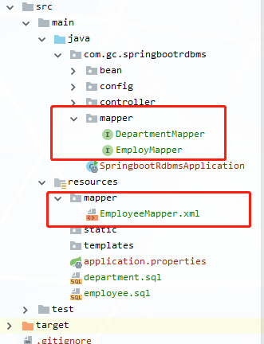

### SpringBoot整合jdbc

依赖：

```xml
<dependency>
    <groupId>mysql</groupId>
    <artifactId>mysql-connector-java</artifactId>
    <scope>runtime</scope>
</dependency>
<dependency>
    <groupId>org.springframework.boot</groupId>
    <artifactId>spring-boot-starter-jdbc</artifactId>
</dependency>
```

配置：

```properties
spring.datasource.driver-class-name=com.mysql.cj.jdbc.Driver
spring.datasource.username=root
spring.datasource.password=password
spring.datasource.url=jdbc:mysql://localhost:3306/airdata
```

1、默认使用的连接池是：com.zaxxer.hikari.HikariDataSource

2、默认连接池的配置在**DataSourceProperties**文件中

自动配置原理：DataSourceAutoConfiguration、DataSourceProperties

1）由DataSourceProperties构建数据库连接池的建造器

```java
public DataSourceBuilder<?> initializeDataSourceBuilder() {
    return DataSourceBuilder.create(this.getClassLoader()).type(this.getType()).driverClassName(this.determineDriverClassName()).url(this.determineUrl()).username(this.determineUsername()).password(this.determinePassword());
}
```

进入DataSourceBuilder，依次选择连接池，顺序：hikari、tomcat、dbcp2。

```java
private static final String[] DATA_SOURCE_TYPE_NAMES = new String[]{"com.zaxxer.hikari.HikariDataSource", "org.apache.tomcat.jdbc.pool.DataSource", "org.apache.commons.dbcp2.BasicDataSource"};// 支持的连接池类型
public static Class<? extends DataSource> findType(ClassLoader classLoader) {
    String[] var1 = DATA_SOURCE_TYPE_NAMES;// 获取连接池类型
    int var2 = var1.length;
    int var3 = 0;
    while(var3 < var2) {// 循环支持的连接池
        String name = var1[var3];
        try {// 从第一个开始加载，能加载就直接使用
            return ClassUtils.forName(name, classLoader);
        } catch (Exception var6) {
            ++var3;// 不能加载就加载下一个
        }
    }
    return null;
}
```

2）属性装配

+ 基本的连接池属性装备**DataSourceProperties**

```java
private boolean generateUniqueName;
private Class<? extends DataSource> type;
private String driverClassName;
private String url;
private String username;
private String password;
private String jndiName;
private DataSourceInitializationMode initializationMode;
private String platform;
private List<String> schema;
private String schemaUsername;
private String schemaPassword;//.......
```

+ 连接池特有属性装配**DataSourceConfiguration**

```java
@Configuration
@ConditionalOnClass({BasicDataSource.class})
@ConditionalOnMissingBean({DataSource.class})
@ConditionalOnProperty(name = {"spring.datasource.type"},
    havingValue = "org.apache.commons.dbcp2.BasicDataSource",matchIfMissing = true)
static class Dbcp2 {
    Dbcp2() {}
    @Bean // 指定前缀为 spring.datasource.dbcp2
    @ConfigurationProperties(prefix = "spring.datasource.dbcp2")
    public BasicDataSource dataSource(DataSourceProperties properties) {
        return (BasicDataSource)DataSourceConfiguration.createDataSource(properties, BasicDataSource.class);
    }
}
```

3）自定义数据源类型

```java
@Configuration
@ConditionalOnMissingBean({DataSource.class})
@ConditionalOnProperty(name = {"spring.datasource.type"})
static class Generic {
    Generic() {}
    @Bean
    public DataSource dataSource(DataSourceProperties properties) {
        return properties.initializeDataSourceBuilder().build();// 根据type配置数据源
    }
}
```

4）**DataSourceInitializerInvoker**，就是一个applicationListener

> 内部调用DataSourceInitializer.createSchema()和initSchema()方法
>
> 但是Springboot默认禁用了这个功能

开启初始化模式：**spring.datasource.initialization-mode=always**

作用：

+ createSchema：执行DDL语句，一般为建表语句。配置fallback：schema
+ initSchema：指定插入更新数据相关SQL。fallback：data

```java
 public boolean createSchema() {
     List<Resource> scripts = this.getScripts("spring.datasource.schema", this.properties.getSchema(), "schema");
     // .........
     this.runScripts(scripts, username, password);
 }
```

```java
public void initSchema() {
	List<Resource> scripts = 					 			   this.getScripts("spring.datasource.data",this.properties.getData(), "data");
     // .........
this.runScripts(scripts, username, password);
```

默认获取文件的文件名

+ classpath:schema.sql  或者  schema-[platform].sql
+ classpath:data.sql 或者 data-[platform].sql

```java
private List<Resource> getScripts(String propertyName, List<String> resources, String fallback) {
    if (resources != null) {
        return this.getResources(propertyName, resources, true);
    } else {
        String platform = this.properties.getPlatform();
        List<String> fallbackResources = new ArrayList();
        fallbackResources.add("classpath*:" + fallback + "-" + platform + ".sql");
        fallbackResources.add("classpath*:" + fallback + ".sql");
        return this.getResources(propertyName, fallbackResources, false);
    }
}
```

###SpringBoot整合Druid数据源

使用Mysql Connector/J 6.x以上的版本，会出现时区异常

```
The server time zone value '�й���׼ʱ��' is unrecognized or represents more than one time zone.
解决方法：
url添加：serverTimezone=UTC
```

1）引入依赖

```xml
<dependency>
    <groupId>com.alibaba</groupId>
    <artifactId>druid</artifactId>
    <version>1.1.10</version>
</dependency>
```

2）配置druid

```properties
# 配置druid数据源
spring.datasource.type=com.alibaba.druid.pool.DruidDataSource
# 初始化数据源，初始化大小、最小、最大
spring.datasource.initialSize=5
spring.datasource.minIdle=5
spring.datasource.maxActive=20
# 设置等待超时时间
spring.datasource.maxWait=60000
# 设置检测空连接的间隔时间，单位ms
spring.datasource.timeBetweenEvictionRunsMillis=60000
# 配置一个连接最小的生存时间，单位ms
spring.datasource.minEvictableIdleTimeMillis=300000
spring.datasource.validationQuery=SELECT 1 FROM DUAL
spring.datasource.testWhileIdle=true
spring.datasource.testOnBorrow=false
spring.datasource.testOnReturn=false
# 打开pacache，并且指定每个链接上pacache的大小
spring.datasource.poolPreparedStatements=false
spring.datasource.maxPoolPreparedStatementPerConnectionSize=20
# 配置监控统计拦截的filters，去掉后监控界面sql无法统计，'wall'用于防火墙
spring.datasource.filters=stat,wall
# 合并多个DruidDataSource的监控数据
spring.datasource.useGlobalDataSourceStat=true
# 通过connectProperties属性来打开mergeSql功能；慢SQL记录
spring.datasource.connectionProperties=druid.stat.mergeSql=true;druid.stat.slowSqlMillis=500
#是否自动回收超时连接
spring.datasource.removeAbandoned=true
#超时时间(以秒数为单位)
spring.datasource.removeAbandonedTimeout=1800
```

3）书写druid的配置类

```java
@Configuration
public class DruidConfig {
    /**
     * 注册druid数据源和关联配置信息
     * @return
     */
    @Bean
    @ConfigurationProperties(prefix = "spring.datasource")
    public DataSource druid(){
        return new DruidDataSource();
    }
    /**
     * 配置druid的监控视图
     */
    @Bean
    public ServletRegistrationBean statViewServlet(){
        ServletRegistrationBean servletRegistrationBean = new ServletRegistrationBean(new StatViewServlet(), "/druid/*");
        // 配置参数
        Map<String,String> initParams = new HashMap<>();
        // 用户名和密码
        initParams.put("loginUser","admin");
        initParams.put("loginPassword","123456");
        // 是否可以重置数据源，禁用HTML页面上的“Reset All”功能
        initParams.put("resetEnable","false");
        // 访问的权限 默认的允许所有访问
        initParams.put("allow","");
        servletRegistrationBean.setInitParameters(initParams);
        return servletRegistrationBean;
    }
    /**
     * 配置druid的web监控filter
     */
    public FilterRegistrationBean webStatFilter(){
        FilterRegistrationBean filterRegistrationBean = new FilterRegistrationBean();
        filterRegistrationBean.setFilter(new WebStatFilter());
        //所有请求进行监控处理
        filterRegistrationBean.addUrlPatterns("/*");
        //添加不需要忽略的格式信息
        filterRegistrationBean.addInitParameter("exclusions", "*.js,*.gif,*.jpg,*.css,/druid/*");
        return filterRegistrationBean;
    }
}
```

4）访问地址：http://ip:port/druid

###Springboot使用Hikari数据源

```properties
#配置连接池
spring.datasource.type=com.zaxxer.hikari.HikariDataSource
#自动提交
spring.datasource.hikari.auto-commit=true
#连接池的最大连接数
spring.datasource.hikari.maximum-pool-size=15
#连接池的最小连接数
spring.datasource.hikari.minimum-idle=5
#一个连接处于idle(空闲)状态的最大时长(ms)，超过会被释放(retired)
spring.datasource.hikari.idle-timeout=30000
#连接池名称
spring.datasource.hikari.pool-name=hikariPool
#一个连接的生命时长(ms),超时而且没被使用则被释放(retired)
spring.datasource.hikari.max-lifetime=1800000
#等待连接池分配连接的最大时长(ms),超过会报SQLException
spring.datasource.hikari.connection-timeout=30000
```

###Springboot使用mybatis

路径配置



springboot的配置文件和pom.xml配置文件

```properties
# 配置mybatis的xml文件位置
mybatis.mapper-locations=classpath:mapper/*.xml
# 配置别名
mybatis.type-aliases-package=com.gc.springbootrdbms.bean
# 配置驼峰式命名 u_id --> uId
mybatis.configuration.map-underscore-to-camel-case=true
```

```xml
<build>
    <resources>
        <resource>
            <directory>src/main/resources</directory>
        </resource>
        <resource>
            <directory>src/main/java</directory>
            <includes>
                <include>**/*.xml</include>
            </includes>
        </resource>
    </resources>
</build>
```

测试

```java
@Mapper
public interface EmployMapper {
    /**
     * 查询所有的员工信息
     * @return
     */
    List<Employee> findAllEmp();

    /**
     * 根据员工号查询员工信息
     * @param id
     * @return
     */
    Employee findEmpById(Integer id);
}
public class MyController {

    @Autowired
    private EmployMapper employMapper;
    
    @GetMapping("emp/{id}")
    @ResponseBody
    public String info(@PathVariable Integer id){
        Employee employee = employMapper.findEmpById(id);
        return employee.toString();
    }
```

###Springboot使用JPA

JPA:ORM（Object Relational Mapping）；

1）、编写一个实体类（bean）和数据表进行映射，并且配置好映射关系；

```java
//使用JPA注解配置映射关系
@Entity //告诉JPA这是一个实体类（和数据表映射的类）
@Table(name = "user_info") //@Table来指定和哪个数据表对应;如果省略默认表名就是user；
public class UserInfo {

    @Id //这是一个主键
    @GeneratedValue(strategy = GenerationType.IDENTITY)//自增主键
    private Integer id;

    @Column(name = "last_name",length = 50) //这是和数据表对应的一个列
    private String lastName;
    @Column //省略默认列名就是属性名
    private String email;
```

2）、编写一个Dao接口来操作实体类对应的数据表（Repository）

```java
//继承JpaRepository来完成对数据库的操作
public interface UserRepository extends JpaRepository<User,Integer> {
}
```

3）、基本的配置JpaProperties

```yaml
spring:  
 jpa:
    hibernate:
#     更新或者创建数据表结构
      ddl-auto: update
#    控制台显示SQL
    show-sql: true
```

