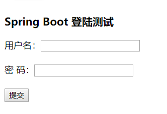

#### Springboot整合jsp和freemarker

> Springboot默认不支持jsp，所以需要创建/webapp/WEB-INF 一是私有jsp页面 二是配置jsp路径

+ springboot会拦截所有的请求，h.css -> h.css.jsp

```jsp
<!--
	解决方法：1、SpringMVC可以直接解析http://localhost:8080/h.css，默认在/staic/xxx
	2、配置静态资源路径: spring.resources.static-locations=.....
-->
String basePath = request.getScheme()+"://"+request.getServerName()+":"+request.getServerPort()+path+"/";
<link rel="stylesheet" type="text/css" href="<%=basePath%>h.css" />
```

+ jsp依赖

```xml
<dependency>
    <groupId>org.apache.tomcat.embed</groupId>
    <artifactId>tomcat-embed-jasper</artifactId>
    <version>8.5.34</version>
</dependency>
<!-- jsp标签库 -->
<dependency>
    <groupId>javax.servlet</groupId>
    <artifactId>jstl</artifactId>
    <version>1.2</version>
</dependency>
<dependency>
    <groupId>javax.servlet</groupId>
    <artifactId>javax.servlet-api</artifactId>
    <scope>provided</scope>
    <version>3.1.0</version>
</dependency>
```
> 访问：http://localhost:8080/user/home



+ freemarker依赖

classpath:templates/下面是freemarker存放的默认目录

```xml
<dependency>
    <groupId>org.springframework.boot</groupId>
    <artifactId>spring-boot-starter-freemarker</artifactId>
    <version>2.0.5.RELEASE</version>
</dependency>
```

> 访问：http://localhost:8080/reg


+ 更换内嵌的web容器

```xml
<!--Spring默认使用tomcat作为web容器-->
<!--1、排除tomcat的依赖哦-->
    <exclusions>
        <!-- 排除tomcat -->
        <exclusion>
            <groupId>org.springframework.boot</groupId>
            <artifactId>spring-boot-starter-tomcat</artifactId>
        </exclusion>
    </exclusions>
<!--2、加入jetty的依赖-->
    <dependency>
        <groupId>org.springframework.boot</groupId>
        <artifactId>spring-boot-starter-jetty</artifactId>
        <version>1.4.0.RELEASE</version>
    </dependency>
```

#### Spring扩展

（1）Spring初始化bean：提供一个接口BeanPostProcessor,使用了JAVA8的接口的default方法

> 分别执行与bean初始化完成与属性设置完成之后和对象的init方法调用之后执行，每一个bean的初始化都会触发一次

（2）对容器的操作：提供一个接口BeanFactoryPostProcessor,该方法执行在容器初始化之后执行,只会触发一次。

（3）动态注入bean

+ 实现BeanFactoryPostProcessor的子接口BeanDefinitionRegistryPostProcessor来实现动态注入bean

```java
// 编码式注入属性，注入bean名称
void postProcessBeanDefinitionRegistry(BeanDefinitionRegistry var1) throws BeansException;
```

+ 
  使用AnnotationConfigApplicationContext 的对象可以实现动态注入，和接口基本一致

#### Springboot基础

配置文件路径：

​	（1）默认在classpath下

​	（2）classpath:config/

​	（3）file:/   或者  file:/config/

修改配置文件名称：xxx.properties

​	启动指定配置文件名称	

​	spring.config.name=xxxx

​	spring.config.location=classpath:conf/.../xxx.properties,file:/E:/temp/xxx.properties,...

加载指定的配置文件

```java
@PropertySource("classpath:conf/db.properties") 可以多个注解加载多个配置文件
@PropertySources(@PropertySource("classpath:conf/db.properties")，@PropertySource("file:/E:/temp/db.properties"),...)
```

配置文件注入值

```java
@ConfigurationProperties(prefix = "book")
private String name;
private List<String> authors = new ArrayList<>();
```

```properties
book.name=spring boot
# 注入集合或者数组
book.authors[0]=tom  
book.authors[1]=abc
acme.enabled=true
acme.remote-address=beijing
# security是acme的静态内部类
acme.security.username=abcdcds
acme.security.password=2123
acme.security.roles=admin
```

动态引入配置文件 实现函数接口EnvironmentPostProcessor

```java
@Component
public class MyEnvironmentPostProcessor implements EnvironmentPostProcessor {

    private final PropertySourceLoader loader = new PropertiesPropertySourceLoader();
    private final YamlPropertySourceLoader loaderYml = new YamlPropertySourceLoader();

    @Override
    public void postProcessEnvironment(ConfigurableEnvironment environment, SpringApplication application) {
        Resource path = new FileSystemResource("E:/logs/springboot.properties");
        environment.getPropertySources().addLast(loadPs(path));
    }
    private PropertySource<?> loadPs(Resource path){
        if(!path.exists()){
            throw new IllegalArgumentException("Resource " + path + " does not exist");
        }
        try{
            return this.loader.load("my",path).get(0);
            //return this.loaderYml.load("custom-resource",path).get(0);
        }catch (Exception e){
            throw new IllegalStateException("Failed to load yaml configuration from " + path, e);
        }
    }
}
```

自动配置

Condition接口，实现根据条件来自动配置,使用在方法或者类上，可以同时指定一个或者多个Condition，需要同时返回true才装配，否则不装配
        修改虚拟机内部参数-D[key]=[value] -Dtest.encoding=gbk
        内置的Condition注解

```properties
 - ConditionalOnBean
 - ConditionalOnMissBean
 - ConditionalOnClass
 - ConditionalOnMissClass
 - ConditionalOnExpression
 - ConditionalOnJava 	根据jdk版本装配> < >= <= 默认是>=
 - ConditionalOnNotWebApplication 不是web环境时装配
 - ConditionalOnWebApplication    是web环境时装配
 - ConditionalOnResource  当某个资源存在时装配
 - ConditionalOnProperty  当某个配置文件存在且存在值时装配
```

```java
public class GBKCondition implements Condition {
    @Override
    public boolean matches(ConditionContext conditionContext, AnnotatedTypeMetadata annotatedTypeMetadata) {
        // 判断配置的参数
        String encoding = System.getProperty("file.encoding");
        if(encoding!=null){
            return "gbk".equals(encoding.toLowerCase());
        }
        return false;
    }
}
public class UTF8Condition implements Condition {
    @Override
    public boolean matches(ConditionContext conditionContext, AnnotatedTypeMetadata annotatedTypeMetadata) {
        String encoding = System.getProperty("file.encoding");
        if(encoding!=null){
            return "utf-8".equals(encoding.toLowerCase());
        }
        return false;
    }
}
@SpringBootConfiguration
public class EncodingConvertConfiguration {

    @Bean
    @Conditional(UTF8Condition.class)// utf8装配这个类 也可以配置多个条件
    @Profile("Development")// 用于Development环境，根据配置文件
    public UTF8EncodingConvert createUTF8EncodingConvert(){
        return new UTF8EncodingConvert();
    }

    @Bean
    @Conditional(GBKCondition.class)// gbk装配这个类
    @Profile("Production")// 用于Production环境
    public GBKEncodingConvert createGBKEncodingConvert(){
        return new GBKEncodingConvert();
    }
}
```

#### Enable*注解原理
> @Import({classType1,classType1..}) 引入一个或者多个配置

+ 导入bean，将导入的类交于Spring管理 User.class 导入user的bean对象
+ 导入一个配置类@Import(MyConfig.class) 类中所有的Bean都会被Spring管理

```properties
@EnableAutoConfiguration 
	@Import({AutoConfigurationImportSelector.class})
AutoConfigurationImportSelector使用了SpringFactoriesLoader.loadFactoryNames方法
直接加载类所在路径的META-INF/spring.factories文件
这个文件中就申明了有哪些自动配置
```

```protobuf
# Auto Configure
org.springframework.boot.autoconfigure.EnableAutoConfiguration=\
org.springframework.boot.autoconfigure.admin.SpringApplicationAdminJmxAutoConfiguration,\
org.springframework.boot.autoconfigure.aop.AopAutoConfiguration,\
org.springframework.boot.autoconfigure.amqp.RabbitAutoConfiguration,\
```

> ImportSelector接口

+ 如果@Import导入了这个实现接口的类，它的selectImport方法返回的字符串数组，如果数组内容(类的全名)所表示的类存在，则会自动交由Spring容器管理
+ spring.factories中声明了很多的自动配置类，这些类就可以根据具体的容器条件实现不同的bean的装配

> ImportBeanDefinitionRegistrar接口

+ 如果@Import导入了这个实现接口的类，它的registerBeanDefinitions方法的参数有一个BeanDefinitionRegistry
+ BeanDefinitionRegistry可以向容器中注入bean

```java
BeanDefinitionBuilder bdb = BeanDefinitionBuilder.rootBeanDefinition(classType);
registry.registerBeanDefinition("beanName", bdb.getBeanDefinition());
```

> @EnableConfigurationProperties原理

+ 导入了EnableConfigurationPropertiesImportSelector implements ImportSelector类
+ 注入了两个类，都实现了ImportBeanDefinitionRegistrar接口

```java
EnableConfigurationPropertiesImportSelector.ConfigurationPropertiesBeanRegistrar.class.getName() ConfigurationPropertiesBindingPostProcessorRegistrar.class.getName()
```

+ 读取注解中的前缀，使用该注解的类的类型。就会对比前缀.属性与properties配置中的key，相同就会注入，最终将组装好的对象交由spring

#### @EnableAutoConfiguration

```java
// 返回的所有全类名都会交由Spring管理
public String[] selectImports(AnnotationMetadata annotationMetadata) {
    if (!this.isEnabled(annotationMetadata)) {
        return NO_IMPORTS;
    } else {
        AutoConfigurationMetadata autoConfigurationMetadata = AutoConfigurationMetadataLoader.loadMetadata(this.beanClassLoader);
        // 获取注解中的值
        AnnotationAttributes attributes = this.getAttributes(annotationMetadata);
        // 一堆需要Spring管理的类
        List<String> configurations = this.getCandidateConfigurations(annotationMetadata, attributes);
        // 去重，根据class(exclude)或者是className(excludeName)，直接获取注解中的排除条件
        configurations = this.removeDuplicates(configurations);
        Set<String> exclusions = this.getExclusions(annotationMetadata, attributes);
        this.checkExcludedClasses(configurations, exclusions);
        configurations.removeAll(exclusions);
        configurations = this.filter(configurations, autoConfigurationMetadata);
        this.fireAutoConfigurationImportEvents(configurations, exclusions);
        return StringUtils.toStringArray(configurations);
    }
}
// 从classpath:META-INF/spring.factories获取key=org.springframework.boot.autoconfigure.EnableAutoConfiguration的所有值
protected List<String> getCandidateConfigurations(AnnotationMetadata metadata, AnnotationAttributes attributes) {
    List<String> configurations = SpringFactoriesLoader.loadFactoryNames(this.getSpringFactoriesLoaderFactoryClass(), this.getBeanClassLoader());
    Assert.notEmpty(configurations, "No auto configuration classes found in META-INF/spring.factories. If you are using a custom packaging, make sure that file is correct.");
    return configurations;
}
// 返回org.springframework.boot.autoconfigure.EnableAutoConfiguration类名
protected Class<?> getSpringFactoriesLoaderFactoryClass() {
    return EnableAutoConfiguration.class;
}
```

+ ImportSelector接口，接口的返回值所对应的类都会交给Spring管理
+ SpringFactoriesLoader类，这个类可以加载classpath:META-INF/spring.factories
+ 从Classpath中搜索所有的配置文件，然后将其中key=org.springframework.boot.autoconfigure.EnableAutoConfiguration的值会加载到Spring的容器中
+ spring.boot.enableautoconfiguration=true时才开启自动配置（默认为true）
+ Class<?>[] exclude() default {};
  + String[] excludeName() default {}; 对bean进行排除

#### Springboot事件监听

1、定义事件，一般是继承ApplicationEvent抽象类

2、定义事件监听器，一般是实现ApplicationListener接口

3、配置监听器：启动时，添加监听器至Spring容器

4、发布事件,ApplicationContext.publishEvent发布事件


