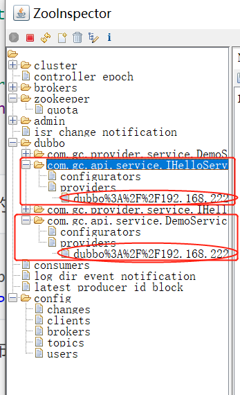

#### 如何在dubbo上注册服务

Dubbo是一个分布式服务框架，致力于提供高性能和透明化的RPC远程服务调用方案,以及SOA服务治理方案。 也是一款高性能、轻量级的开源Java RPC框架，它提供了三大核心能力：面向接口的远程方法调用，智能容错和负载均衡，以及服务自动注册和发现。

+  面向接口代理的高性能RPC调用
+  服务自动注册与发现
+  运行期流量调度
+ 智能负载均衡
+ 高度可扩展能力
+ 高度可扩展能力

特点详见：http://dubbo.apache.org/zh-cn/docs/user/maturity.html

注册中心特点

+ 外部化配置
  + 实现配置的集中式管理（可以理解为将dubbo.propertites存储在外部）
  + 外部配置拥有比本地配置高的优先级
  + 外部配置的作用域广，作用于全局和应用
+ 服务治理

配置文件覆盖-Doption > properties config > java API  > localFileConfig

负载均衡策略

+ Random LoadBalance：按权重设置随机概率
+ RoundRobin LoadBalance：轮询，按公约的权重比例设置轮询比率
+ LeastActive LoadBalance：最少活跃调用数，相同活跃数的随机，活跃数指调用前后计数差。
+ ConsistentHash LoadBalance：一致性Hash，相同参数的请求总是发到同一提供者

1、创建公共API工程，为不同的项目提供API接口

2、创建服务发布的工程

（1）引入依赖

```xml
<dependency>
    <groupId>com.gc</groupId>
    <artifactId>api</artifactId>
    <version>0.0.1-SNAPSHOT</version>
</dependency>
<dependency>
    <groupId>org.springframework.boot</groupId>
    <artifactId>spring-boot-starter</artifactId>
</dependency>
<dependency>
    <groupId>com.alibaba.boot</groupId>
    <artifactId>dubbo-spring-boot-starter</artifactId>
    <version>0.2.0</version>
</dependency>
<!--zk的客户端工具-->
<dependency>
    <groupId>com.github.sgroschupf</groupId>
    <artifactId>zkclient</artifactId>
    <version>0.1</version>
    <exclusions>
        <exclusion>
            <groupId>log4j</groupId>
            <artifactId>log4j</artifactId>
        </exclusion>
    </exclusions>
</dependency>
<dependency>
    <groupId>org.springframework.boot</groupId>
    <artifactId>spring-boot-starter-test</artifactId>
    <scope>test</scope>
</dependency>
<!--将log4j转为slf4j-api-->
<dependency>
    <groupId>org.slf4j</groupId>
    <artifactId>log4j-over-slf4j</artifactId>
    <version>1.7.25</version>
</dependency>
<!--实现logback-->
<dependency>
    <groupId>ch.qos.logback</groupId>
    <artifactId>logback-core</artifactId>
</dependency>
```

（2）配置

```yml
spring:
  application:
    name: provider # 配置应用名称

# 配置服务的版本
demo:
  service:
    version: 1.1.1

dubbo:
  application:
    name: dubbo-provider
  protocol:
    name: dubbo
    port: 20880
  registry:
    address: zookeeper://192.168.222.128:12181
  provider:
    timeout: 1000
  scan:
    base-packages: com.gc.provider.service
```

（3）实现服务接口

```java
@Component
@Service(interfaceClass = IHelloService.class)
public class HelloServiceImpl implements IHelloService {

    @Override
    public void sayHello() {
        System.out.println("provider say hello.....");
    }
}
@Service(version = "demo.service.version")
public class DefaultDemoService implements DemoService {
    
    @Value("${dubbo.application.name}")
    private String serviceName;

    @Override
    public String sayHello(String name) {
        return String.format("[%s] : Hello, %s", serviceName, name);
    }
}
```

（4）开启dubbo的自动配置

```java
@EnableDubbo
@SpringBootApplication
public class ProviderApplication {
```

（5）运行项目发布服务



#### 调用服务

pom文件与服务提供者的pom文件相同

配置

```yml
spring:
  application:
    name: consumer # 配置应用名称
dubbo:
  application:
    name: dubbo-consumer
  registry:
    address: zookeeper://192.168.222.128:12181
server:
  port: 8081

# 配置服务的版本
demo:
  service:
    version: 1.1.1
```

（1）开启dubbo的自动配置

```java
@EnableDubbo
@SpringBootApplication
public class ConsumerApplication {
```

（2）调用服务

```java
	@Reference(interfaceClass = IHelloService.class)
    IHelloService helloService;

    @Reference(version = "demo.service.version")
    DemoService demoService;

    @GetMapping("/hello")
    public String hello() {
        helloService.sayHello();
        return "consumer hello .....";
    }

    @GetMapping("/demo/{name}")
    public String demo(@PathVariable("name") String name){
        return demoService.sayHello(name);
    }
```


